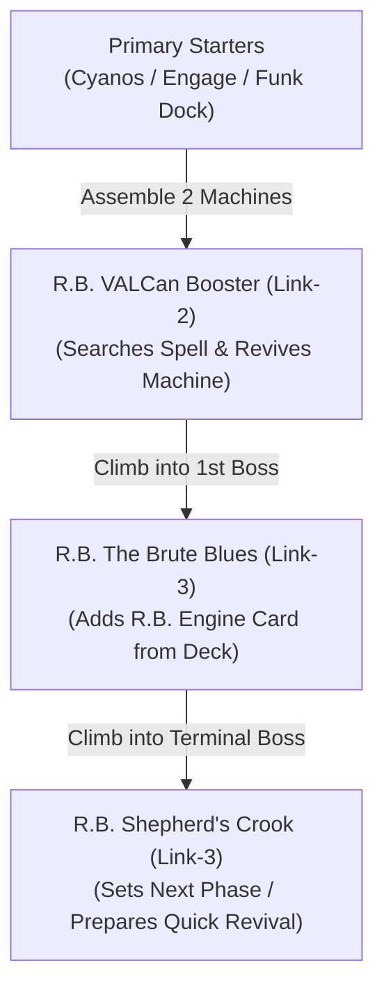

# Archetype Profile: R.B. (Revol-Bots)

**Tier / Classification:** Competitive Rogue / Engine-Intensive Combo  
**Primary Attributes & Types:** FIRE & EARTH Machine  
**Core Summoning Mechanics:** Link Climbing (Link-1 $\to$ Link-2 $\to$ Link-3), Rapid Machine Swarming  
**Target Deck Size:** 40 Cards (Maximized Consistency)  

---

## 1. Canonical Engine Core & Ratios

### Main Deck Engine
* **Mandatory 3-Ofs (Linchpins & Core Swarm):**
  - `R.B. Ga10 Driller` ($3\times$) — Primary Special Summon extender when controlling no monsters or another Machine.
  - `R.B. Ga10 Cutter` ($3\times$) — Machine extender and secondary battle/removal tool.
  - `R.B. Funk Dock` ($3\times$) — Archetypal ignition field spell; searches core pieces and generates additional normal/special presence.
  - `Sky Striker Ace - Cyanos` ($3\times$) — High-impact 1-card starter assembling two Machine bodies on Normal Summon.
* **1-to-2-Ofs (Secondary Starters, Extenders & Search Targets):**
  - `R.B. VALCan Rocket` ($2\times$) — Mid-combo discard ignition and graveyard setup.
  - `R.B. Ga10 Pile Bunker` ($1\text{–}2\times$) — High-stat Level 7 extender and removal punch.
  - `R.B. Stage Landing` ($2\times$) — Archetypal search and revival spell.
  - `Sky Striker Mobilize - Engage!` ($1\text{–}2\times$) — Generic search engine for Machine token generation.
  - `Sky Striker Mecha - Hornet Drones` ($1\times$) — 1-card Machine generator (creates Kagari/Booster bridge).
  - `Sky Striker Ace - Roze` ($1\times$) — Paired extender; live when opened alongside any R.B. Extender.
* **Engine Traps (Searchable Interruption & Payoffs):**
  - `R.B. Next Phase` ($1\times$) — Searchable counter/removal trap set directly by *Shepherd's Crook*.
  - `R.B. Last Stand` ($1\times$) — Protection and board-reset recovery trap.

### Extra Deck Engine
* `R.B. VALCan Booster` ($2\times$, Link-2 Machine) — Vital combo pivot; retrieves spell on link summon and special summons Machine from GY/hand.
* `R.B. The Brute Blues` ($1\times$, Link-3 Machine) — Mid-combo boss; searches archetypal card upon summon before climbing further.
* `R.B. Shepherd's Crook` ($1\times$, Link-3 Machine) — Terminal end-board anchor; sets `Next Phase` / `Last Stand` directly from Deck or GY and provides opponent-turn Quick Effect revival.
* `Sky Striker Ace - Kagari` ($1\times$, Link-1 Machine) — Recycles `Hornet Drones` to supply the 2nd Machine body.
* `Sky Striker Ace - Camellia` ($1\times$, Link-2 Machine) — The universal emergency bridge enabling combo lines out of bricked hands.

---

## 2. Functional Taxonomy Classifications

* **`[STARTER-NS]` (Normal Summon Starters, strictly capped at 4–6):**
  - `Sky Striker Ace - Cyanos` ($3\times$) — Normal Summon ignites 2-Machine body generation.
* **`[STARTER-SS]` (Special Summon Starters / Free Bodies):**
  - `Sky Striker Mecha - Hornet Drones` ($1\times$) — Free Level 4 Machine token.
  - `Sky Striker Mobilize - Engage!` ($1\text{–}2\times$) — Searches Hornet Drones.
  - `R.B. Funk Dock` ($3\times$) — Field spell ignition without consuming Normal Summon.
* **`[STARTER-1.5]` (2-Card Discard / Synergy Starters):**
  - `R.B. Stage Landing` ($2\times$) — Requires discard or monster on field/GY.
* **`[EXTENDER]` (Free Body Swarm):**
  - `R.B. Ga10 Driller` ($3\times$)
  - `R.B. Ga10 Cutter` ($3\times$)
  - `R.B. Ga10 Pile Bunker` ($1\text{–}2\times$)
  - `R.B. VALCan Rocket` ($2\times$)
  - `Sky Striker Ace - Roze` ($1\times$) — Not dead when opened with an R.B. extender: SS R.B. extender first, NS Roze, link Roze into Kagari/Camellia $\to$ proceed to *VALCan Booster*.
* **`[HARD-BRICK]` / `[ENGINE-BRICK]`:**
  - `R.B. Next Phase` ($1\times$) & `R.B. Last Stand` ($1\times$) — Pure engine traps. Suboptimal to open raw; must be set from Deck/GY via *Shepherd's Crook*.

---

## 3. End-Board Routing & Sequencing

### A. Turn 1 Uninterrupted Routing (Chronological Multi-Boss Flow)

1. **Ignition:** Assemble 2 Machine bodies on field (via Cyanos, Drones, or Driller + Extender).
2. **Pivot:** Link Summon `R.B. VALCan Booster` (Link-2). Trigger effect to search Stage Landing/Funk Dock and Special Summon 1 Machine from GY/hand.
3. **Boss 1 (`The Brute Blues`):** Link climb into `R.B. The Brute Blues` (Link-3) **first**. Trigger effect to add targeted R.B. piece from Deck to hand.
4. **Boss 2 (`Shepherd's Crook`):** Link climb into `R.B. Shepherd's Crook` (Link-3) **second**. Set `R.B. Next Phase` directly from Deck or GY.
5. **End-Board State:** `Shepherd's Crook` on field + `Next Phase` set (disruption) + loaded GY for opponent-turn Quick Effect revival.

### B. Emergency Generic Bridge: The "Camellia Line"
When opening zero primary starters but holding `[Hand Trap + R.B. Extender]`:
1. Normal Summon any Hand Trap (Effect Monster, e.g. *Ash Blossom* or *Droll*).
2. Special Summon any R.B. Extender (*Ga10 Driller* or *Ga10 Cutter*).
3. Link Summon `Sky Striker Ace - Camellia` (Link-2, requires 2 Effect Monsters).
4. Camellia on-summon effect sends `Sky Striker Mecha - Hornet Drones` from Deck to GY.
5. Link Camellia into `Sky Striker Ace - Kagari` (Link-1 Machine).
6. Kagari on-summon retrieves `Hornet Drones` from GY $\to$ activate Drones to summon Machine Token.
7. You now control Kagari (Machine) + Token (Machine) = **2 Machine bodies** $\rightarrow$ Link Summon `R.B. VALCan Booster` $\rightarrow$ proceed to full combo!

### C. Going-First Setup Shedding (Sideboard Strategy)
When transitioning to **Going Second** (Games 2 & 3), shed these 3 setup-dependent cards in favor of non-engine board breakers:
1. **Cut:** `R.B. Last Stand` ($1\times$) $\rightarrow$ **In:** `Evenly Matched` / `Dark Ruler No More` ($1\times$)
2. **Cut:** `R.B. Next Phase` ($1\times$) $\rightarrow$ **In:** `Nibiru, the Primal Being` / `Kaiju` ($1\times$)
3. **Cut:** `R.B. Ga10 Pile Bunker` ($1\times$) $\rightarrow$ **In:** `Cosmic Cyclone` / `Lightning Storm` ($1\times$)

---

## 4. Proven Secondary Engine Synergies (Pile Clustering)

* **Sky Striker Engine (Cyanos / Engage / Drones / Roze):**
  - Synergy: Cyanos and Hornet Drones summon Machine bodies without locking the player out of Link monsters.
  - Size: 6–8 cards (clustered as secondary engine, not generic tech).
* **Therion Engine (Regulus):**
  - Synergy: `Therion "King" Regulus` equips any Machine from GY (such as *VALCan Booster*) to provide an omni-negate before the 5th summon window.
* **Strict Anti-Synergies & Restrictions:**
  - Avoid cards that lock into non-Machine types or non-Link summoning mechanics during the early combo phase.

---

## 5. Chokepoints & Counter-Play Matrix

| Opponent Interruption | Target Chokepoint | Severity | Mitigation & Counter-Line |
| :--- | :--- | :---: | :--- |
| **Ash Blossom & Joyous Spring** | *VALCan Booster* on-summon effect | **High** | Pivot directly into *Shepherd's Crook* using remaining extenders to ensure trap setup. |
| **Nibiru, the Primal Being** | 5th Summon Window | **Critical** | Prioritize early *Regulus* summon or establish *Shepherd's Crook* by summon #4. |
| **Droll & Lock Bird** | 1st Search (*Cyanos* / *Engage*) | **Medium** | R.B. can still swarm using hand extenders (*Driller*, *Cutter*) to assemble *Shepherd's Crook*. |
| **Infinite Impermanence** | *VALCan Booster* | **High** | Chain quick-play removal or tribute effects if available; else link climb with extenders. |

---

## 6. Hypergeometric Benchmarks (40-Card Standard)

* **Turn 1 Starter Probability ($n = 5$):**
  - Starters in Deck: **14** (3 Cyanos, 3 Funk Dock, 1 Drones, 2 Engage, 2 Stage Landing, 3 Driller).
  - Opening $\ge 1$ Starter: **$90.0\%$** (Consistently meets $>90\%$ target threshold).
* **Turn 0 Hand Trap Quota ($n = 5$):**
  - Hand Traps: **12–14** non-engine slots.
  - Opening $\ge 1$ Hand Trap: **$85.1\%$ to $90.0\%$**.
* **Hard Brick Quota:**
  - Hard Bricks (*Next Phase*, *Last Stand*): **2 cards**.
  - Risk of drawing both: **$< 1.3\%$**.
  - Risk of drawing $\ge 1$: **$23.7\%$** (both can be discarded via Stage Landing/Rocket or set manually).

---

## 7. Architectural Provenance & Monorepo Links
* **ADR Design Record:** [ADR-002: Competitive Deck Architecture & Hypergeometric Probability Engine](../../../../docs/decisions/ADR-002-deck-architect-skill.md)
* **Monorepo Architecture:** [ADR-004: Monorepo Architecture, Git Bloat Protection & Obsidian Branding](../../../../docs/decisions/ADR-004-root-monorepo-structure.md)
* **Parent Skill:** [`ygo-deck-architect` SKILL.md](../../SKILL.md)
