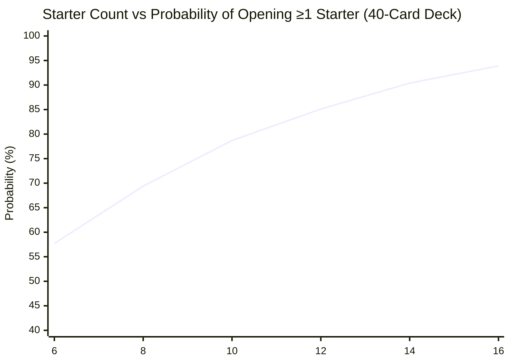

# Graph Generation Engine for Deck Architecture

This reference guides the agent on how to render deterministic ASCII bar charts and Mermaid probability diagrams.

---

## 1. ASCII Probability Meter Template
Use a 25-character bar width (`█` = 4%, `▌` = 2%, `▎` = 1%):

```text
================================================================================
PROBABILITY DISTRIBUTION: [Metric Description]
================================================================================
Turn 1 Starter (≥1 in 5):     [██████████████████████▌  ] 90.4% [>90% GOAL MET]
Turn 0 Hand Trap (≥1 in 5):   [█████████████████████▎   ] 85.1%
Turn 0 Hand Trap (≥2 in 5):   [███████████▉             ] 47.7%
Turn 2 Breaker (≥1 in 6):     [████████████████▎        ] 65.0%
Opening 1-of Hard Brick:      [███                      ] 12.5%
================================================================================
```

---

## 2. Mermaid Probability Curve Template
Used for web and IDE environments that render Mermaid diagrams natively:



---

## 3. Hand Trap Multi-Event Density Distribution
Visualizes how non-engine interruption stacks in a 5-card Turn 0 hand:

```text
[TURN 0 HAND TRAP DENSITY: 15 Hand Traps in 40 Cards]
├─ 0 Interruptions (Fatal):   8.1%  | ██▋
├─ 1 Interruption:           28.8%  | ███████▎
├─ 2 Interruptions:          36.7%  | █████████▎
└─ 3+ Interruptions:         26.4%  | ██████▌
```

---

## 4. Architectural Provenance & Monorepo Links
* **ADR Design Record:** [ADR-002: Competitive Deck Architecture & Hypergeometric Probability Engine](../../../docs/decisions/ADR-002-deck-architect-skill.md)
* **Monorepo Architecture:** [ADR-004: Monorepo Architecture, Git Bloat Protection & Obsidian Branding](../../../docs/decisions/ADR-004-root-monorepo-structure.md)
* **Core Skill Definition:** [`ygo-deck-architect` SKILL.md](../SKILL.md)
