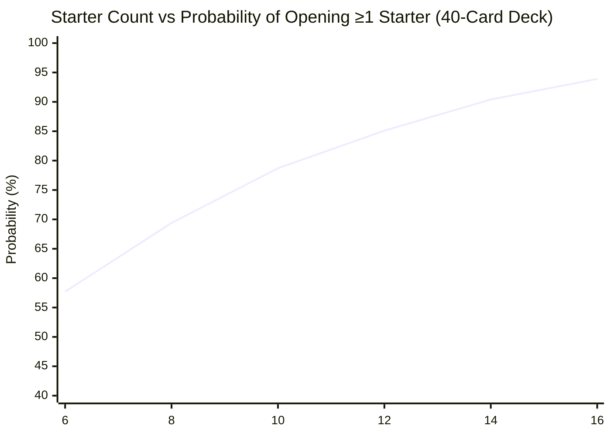
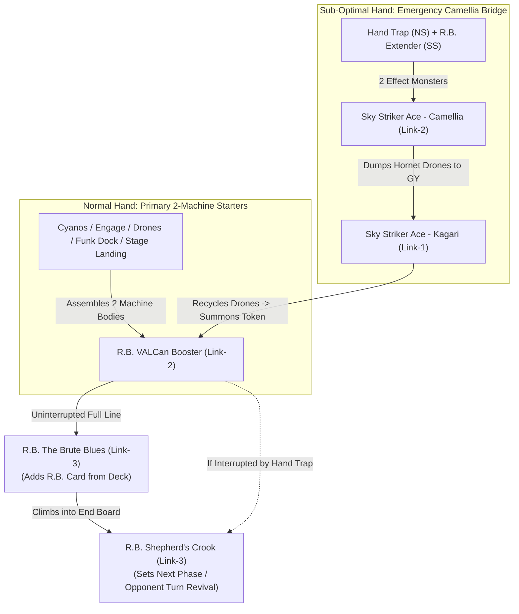

# Graph Generation Engine for Deck Architecture

This reference guides the agent on how to render deterministic ASCII bar charts and Mermaid probability diagrams.

---

## 1. ASCII Probability Meter Template
Use a 25-character bar width (`█` = 4%, `▌` = 2%, `▎` = 1%):

```text
================================================================================
PROBABILITY DISTRIBUTION: [Metric Description]
================================================================================
Opening 1+ Starters (T1):    [█████████████████████▌  ] 90.0% [>90% GOAL MET]
Normal Summon = 1 (Sweet):   [██████████▏             ] 42.3% [OPTIMAL NS ALLOCATION]
Normal Summon ≥2 (Clash):    [███▋                    ] 15.4% [SAFE: <= 20%]
Turn 0 Hand Trap ≥1 (T0):    [████████████████████▍   ] 85.1%
Turn 0 Hand Trap ≥2 (T0):    [███████████▍            ] 47.7%
Turn 2 Breaker ≥1 (T2):      [█████████▍              ] 39.4%
Opening 1+ Hard Brick:       [███                     ] 12.5%
Net Playable Hand (T1):      [███████████████████     ] 79.4%
Starter + Hand Trap (T0):    [██████████████████      ] 75.4%
G2 Quality Hand (HT+S+E/B):  [██████████████▊         ] 61.7%
================================================================================
```

---

## 2. Mermaid Probability Curve Template
Used for web and IDE environments that render Mermaid diagrams natively:



---

## 3. Hand Trap Multi-Event Density Distribution
Visualizes how non-engine interruption stacks in a 5-card Turn 0 hand:

```text
[TURN 0 HAND TRAP DENSITY: 15 Hand Traps in 40 Cards]
├─ 0 Interruptions (Fatal):   8.1%  | ██▋
├─ 1 Interruption:           28.8%  | ███████▎
├─ 2 Interruptions:          36.7%  | █████████▎
└─ 3+ Interruptions:         26.4%  | ██████▌
```

---

## 4. Multi-Boss Combo Routing & Interruption Flowcharts

When modeling Link-based and multi-boss combo strategies in Mermaid:
1. **Full-Combo Chronological Sequencing:**
   * Always order bosses by their resolution sequence.
   * *Example (R.B. Core):* `VALCan Booster` (Link-2) searches spell and summons from GY/hand $\rightarrow$ Links into **`The Brute Blues` (Link-3)** first (searches R.B. card from Deck) $\rightarrow$ Links into **`Shepherd's Crook` (Link-3)** (sets `Next Phase` or `Last Stand` from Deck/GY and prepares the opponent-turn Quick Effect revival).
2. **Interruption & Resilient Fallback Paths:**
   * Graph an explicit fallback branch for opponent hand traps. If `VALCan Booster` is negated or interrupted, the player pivots directly into `Shepherd's Crook` to guarantee at least 1 trap interruption.
3. **Emergency Generic Bridges (The "Camellia Line"):**
   * Graph universal 2-monster Link bridges that rescue bricked hands.
   * *Pattern:* Opening `[Hand Trap + Extender]` (0 primary starters) $\rightarrow$ Normal Summon Hand Trap (Effect Monster) + Special Summon Extender $\rightarrow$ Link Summon `Sky Striker Ace - Camellia` (Link-2 Machine) $\rightarrow$ Send `Hornet Drones` to GY $\rightarrow$ Link into `Kagari` $\rightarrow$ Retrieve `Hornet Drones` $\rightarrow$ Special Summon Token $\rightarrow$ Assemble 2 Machine bodies $\rightarrow$ Proceed to full combo!



---

## 5. Architectural Provenance & Monorepo Links
* **ADR Design Record:** [ADR-002: Competitive Deck Architecture & Hypergeometric Probability Engine](../../../docs/decisions/ADR-002-deck-architect-skill.md)
* **Monorepo Architecture:** [ADR-004: Monorepo Architecture, Git Bloat Protection & Obsidian Branding](../../../docs/decisions/ADR-004-root-monorepo-structure.md)
* **Core Skill Definition:** [`ygo-deck-architect` SKILL.md](../SKILL.md)
